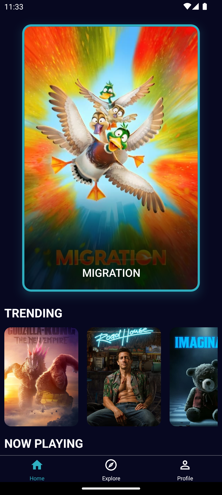
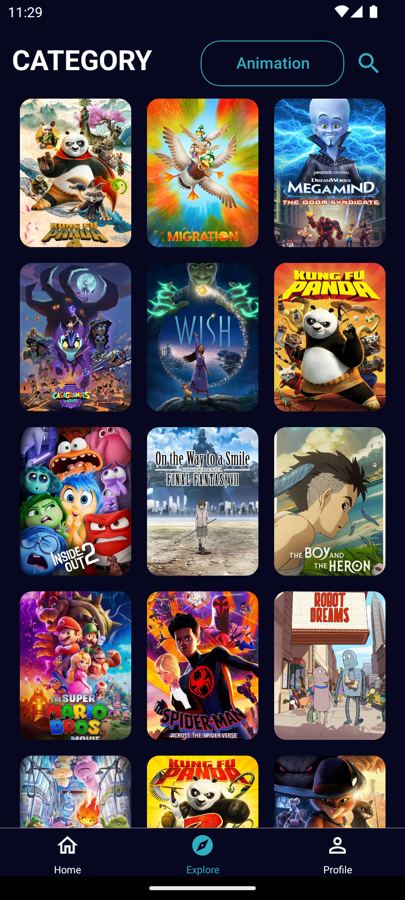
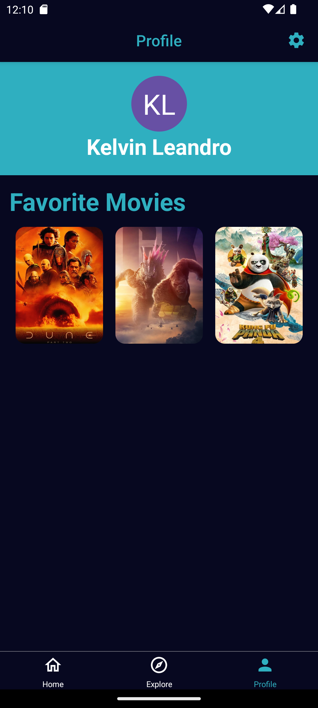
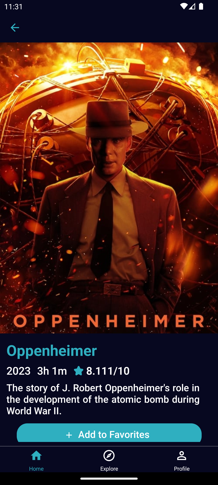
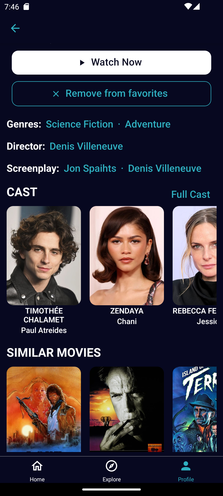
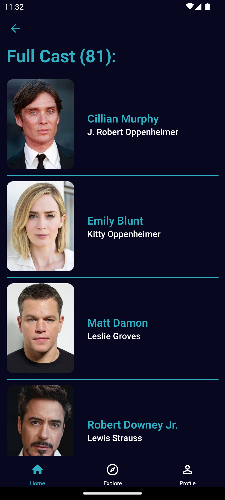

# Movie App

A simple yet powerful React Native app to explore movies, utilizing the TMDB API. Built with Expo, TypeScript, and styled with styled-components. This app allows users to browse movies, view detailed information, and mark movies as favorites.

## Preview

<style>
  .grid-container {
    display: grid;
    grid-template-columns: auto auto auto;
    gap: 10px;
  }

  .grid-item {
    display: flex;
    flex-direction: column;
    align-items: center;
    text-align: center;
    padding: 20px;
    border: 1px solid black;
  }

  .grid-item img {
    width: 100%;
    max-width: 250px;
    height: auto;
    margin-top: 10px;
  }

  @media screen and (max-width: 600px) {
    .grid-container {
      grid-template-columns: auto auto;
    }
  }
</style>

<div class="grid-container">
  <div class="grid-item">
    Home Screen
    
  </div>
  <div class="grid-item">
    Explore Screen
    
  </div>
  <div class="grid-item">
    Profile Screen
    
  </div>
  <div class="grid-item">
    Movie Detail
    
  </div>
  <div class="grid-item">
    Movie Detail
    
  </div>
  <div class="grid-item">
    Full cast screen
    
  </div>
</div>

## Features

- **Explore Movies:** Browse through a list of movies based fetched from the TMDB API.
- **Movie Details:** View detailed information about the movies, including synopsis, cast, year, runtime and similar movies.
- **Favorites:** Mark movies as favorites (Note: Favorites are not persisted across app reloads).
- **Search Functionality:** Search for movies using the TMDB API.

## Tech Stack

- **Framework:** React Native (Expo)
- **Programming Language:** TypeScript
- **Styling:** Styled-Components
- **API Integration:** Axios for TMDB API requests
- **UI Components:** React Native Paper

## Getting Started

### Prerequisites

- Node.js installed on your machine
- An API access token from TMDB for fetching movies
- Expo Go installed on your phone or an Android/iOS emulator

### Installation

1. Clone the repository:
   ```sh
   git clone https://github.com/kelvinleandro/movie-app.git
   ```
2. Install dependencies:
   ```sh
   npm install
   ```
3. Add your TMDB API access token in `src/api/instance.ts`:
   ```
   const ACCESS_TOKEN= <your_access_token_here>;
   ```
4. Start the app:
   ```sh
   npm start
   ```

## Project Structure

- `src/api`: Contains the API instance and helper functions for TMDB API requests.
- `src/assets`: Static assets like icons and splash screen images.
- `src/components`: Reusable components structured by screens and UI elements.
- `src/constants`: Application constants, e.g., color definitions.
- `src/context`: React contexts, e.g., for managing favorite movies.
- `src/hooks`: Custom React hooks, e.g., for API calls.
- `src/navigation`: Navigation setup using React Navigation.
- `src/screens`: Individual screens of the app.
- `src/types`: TypeScript type definitions specific to the app.
- `src/utils`: Utility functions.

## Note

This app is for pratice purposes and does not persist favorites data across app reloads. To fully utilize the TMDB API, you must obtain and configure your own API access token.

## License

This project is licensed under the MIT License - see the LICENSE file for details.
